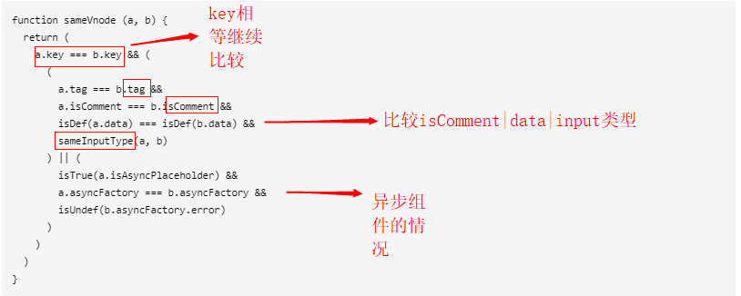

# 搭建 Vue 源码调试环境步骤

- npm install
- npm run setup
- 修改 \build\config.js 文件中的 function genConfig (name) {}内部的配置对象const config = {xxx}，在其中加入sourceMap: true 字段
- npm run dev 启动调试环境
- 打开 /example/demo/index.html 文件，修改其中 script[src]对 vue 的引用，修改其文件名为：vue.min.js->vue.js，然后在浏览器中直接打开该 html,进行调试。

## Vue 中的虚拟 Dom 实现

### 什么是虚拟Dom

Vue 中定义 Vnode 类,详见 src/core/vdom/vnode.js

```js
export default class VNode {
  tag: string | void;
  data: VNodeData | void;
  children: ?Array<VNode>;
  text: string | void;
  elm: Node | void;
  ns: string | void;
  context: Component | void; // rendered in this component's scope
  key: string | number | void;
  componentOptions: VNodeComponentOptions | void;
  componentInstance: Component | void; // component instance
  parent: VNode | void; // component placeholder node

  // strictly internal
  raw: boolean; // contains raw HTML? (server only)
  isStatic: boolean; // hoisted static node
  isRootInsert: boolean; // necessary for enter transition check
  isComment: boolean; // empty comment placeholder?
  isCloned: boolean; // is a cloned node?
  isOnce: boolean; // is a v-once node?
  asyncFactory: Function | void; // async component factory function
  asyncMeta: Object | void;
  isAsyncPlaceholder: boolean;
  ssrContext: Object | void;
  fnContext: Component | void; // real context vm for functional nodes
  fnOptions: ?ComponentOptions; // for SSR caching
  devtoolsMeta: ?Object; // used to store functional render context for devtools
  fnScopeId: ?string; // functional scope id support

  constructor (
    tag?: string,
    data?: VNodeData,
    children?: ?Array<VNode>,
    text?: string,
    elm?: Node,
    context?: Component,
    componentOptions?: VNodeComponentOptions,
    asyncFactory?: Function
  ) {
    this.tag = tag
    this.data = data
    this.children = children
    this.text = text
    this.elm = elm
    this.ns = undefined
    this.context = context
    this.fnContext = undefined
    this.fnOptions = undefined
    this.fnScopeId = undefined
    this.key = data && data.key
    this.componentOptions = componentOptions
    this.componentInstance = undefined
    this.parent = undefined
    this.raw = false
    this.isStatic = false
    this.isRootInsert = true
    this.isComment = false
    this.isCloned = false
    this.isOnce = false
    this.asyncFactory = asyncFactory
    this.asyncMeta = undefined
    this.isAsyncPlaceholder = false
  }
```

## 为什么需要 Virtual Dom?

以 JS 的操作性能来换取操作真实 DOM 所消耗的性能。

## 虚拟 DOM Diff 算法——patch 过程

详见 src/core/vdom/patch.js,重点考虑以下这种情况：
新的节点内包含子节点，旧的节点里也包含了子节点，需要递归对比更新子节点。

```js
function updateChildren (parentElm, oldCh, newCh, insertedVnodeQueue, removeOnly) {
    // console.log('更新子节点 updateChildren', oldCh, newCh  )
    let oldStartIdx = 0
    let newStartIdx = 0
    let oldEndIdx = oldCh.length - 1
    let oldStartVnode = oldCh[0]
    let oldEndVnode = oldCh[oldEndIdx]
    let newEndIdx = newCh.length - 1
    let newStartVnode = newCh[0]
    let newEndVnode = newCh[newEndIdx]
    let oldKeyToIdx, idxInOld, vnodeToMove, refElm

    // removeOnly is a special flag used only by <transition-group>
    // to ensure removed elements stay in correct relative positions
    // during leaving transitions
    const canMove = !removeOnly

    if (process.env.NODE_ENV !== 'production') {
      checkDuplicateKeys(newCh)
    }
    // console.log('vnode diff 循环一次',oldCh, newCh, oldStartVnode, newStartVnode, oldStartIdx, oldEndIdx, newStartIdx, newEndIdx )
    while (oldStartIdx <= oldEndIdx && newStartIdx <= newEndIdx) {
      console.log('vnode diff 循环一次',oldCh, newCh )
      if (isUndef(oldStartVnode)) {
        oldStartVnode = oldCh[++oldStartIdx] // Vnode has been moved left
      } else if (isUndef(oldEndVnode)) {
        oldEndVnode = oldCh[--oldEndIdx]
      } else if (sameVnode(oldStartVnode, newStartVnode)) {
        console.log('首首相同')
        patchVnode(oldStartVnode, newStartVnode, insertedVnodeQueue, newCh, newStartIdx)
        oldStartVnode = oldCh[++oldStartIdx]
        newStartVnode = newCh[++newStartIdx]
      } else if (sameVnode(oldEndVnode, newEndVnode)) {
        console.log('尾尾相同')
        patchVnode(oldEndVnode, newEndVnode, insertedVnodeQueue, newCh, newEndIdx)
        oldEndVnode = oldCh[--oldEndIdx]
        newEndVnode = newCh[--newEndIdx]
      } else if (sameVnode(oldStartVnode, newEndVnode)) { // Vnode moved right
        // console.log('首尾相同')
        patchVnode(oldStartVnode, newEndVnode, insertedVnodeQueue, newCh, newEndIdx)
        if(canMove) {
          console.log('首尾相同', '移动节点位置')
          nodeOps.insertBefore(parentElm, oldStartVnode.elm, nodeOps.nextSibling(oldEndVnode.elm))
        }
        oldStartVnode = oldCh[++oldStartIdx]
        newEndVnode = newCh[--newEndIdx]
      } else if (sameVnode(oldEndVnode, newStartVnode)) { // Vnode moved left
        // console.log('尾首相同')
        patchVnode(oldEndVnode, newStartVnode, insertedVnodeQueue, newCh, newStartIdx)
        if (canMove) {
          console.log('尾首相同', '移动节点位置')
          nodeOps.insertBefore(parentElm, oldEndVnode.elm, oldStartVnode.elm)
        }
        oldEndVnode = oldCh[--oldEndIdx]
        newStartVnode = newCh[++newStartIdx]
      } else {
        console.log('首尾 尾首 均不相同')
        if (isUndef(oldKeyToIdx)) oldKeyToIdx = createKeyToOldIdx(oldCh, oldStartIdx, oldEndIdx)
        idxInOld = isDef(newStartVnode.key)
          ? oldKeyToIdx[newStartVnode.key]
          : findIdxInOld(newStartVnode, oldCh, oldStartIdx, oldEndIdx)
        if (isUndef(idxInOld)) { // New element
          createElm(newStartVnode, insertedVnodeQueue, parentElm, oldStartVnode.elm, false, newCh, newStartIdx)
        } else {
          vnodeToMove = oldCh[idxInOld]
          console.log('1111',vnodeToMove, idxInOld)
          // let vnodeMoveNew = newCh[old]
          if (sameVnode(vnodeToMove, newStartVnode)) {
            patchVnode(vnodeToMove, newStartVnode, insertedVnodeQueue, newCh, newStartIdx)
            oldCh[idxInOld] = undefined
            console.log('insertBefore','移动节点位置')
            canMove && nodeOps.insertBefore(parentElm, vnodeToMove.elm, oldStartVnode.elm)
          } else {
            // same key but different element. treat as new element
            createElm(newStartVnode, insertedVnodeQueue, parentElm, oldStartVnode.elm, false, newCh, newStartIdx)
          }
        }
        newStartVnode = newCh[++newStartIdx]
      }
    }
    if (oldStartIdx > oldEndIdx) {
      refElm = isUndef(newCh[newEndIdx + 1]) ? null : newCh[newEndIdx + 1].elm
      addVnodes(parentElm, refElm, newCh, newStartIdx, newEndIdx, insertedVnodeQueue)
    } else if (newStartIdx > newEndIdx) {
      removeVnodes(oldCh, oldStartIdx, oldEndIdx)
    }
  }
```

## 更新子节点——优化策略

- React 和 Vue 做的假设是：检测 VDOM 的变化只发生在同一层;检测 VDOM 的变化依赖于用户指定的key

- Vue 为了避免双重循环数据量大事件复杂度高带来的性能问题，而选择累了从子节点数组的四个特殊位置互相比对，分别是：新前和旧后，新后和旧后，新后和旧前，新前和旧前。

## 把新的 vnode patch 到 旧的 vnode 上

详见 patchVnode 方法
```js
 function patchVnode (
    oldVnode,
    vnode,
    insertedVnodeQueue,
    ownerArray,
    index,
    removeOnly
  ) {
    // console.log('patch node', oldVnode, vnode)
    if (oldVnode === vnode) {
      console.log('节点完全相同')
      return
    }

    if (isDef(vnode.elm) && isDef(ownerArray)) {
      // clone reused vnode
      vnode = ownerArray[index] = cloneVNode(vnode)
      // console.log('cloneVnode', vnode)
    }

    const elm = vnode.elm = oldVnode.elm

    if (isTrue(oldVnode.isAsyncPlaceholder)) {
      if (isDef(vnode.asyncFactory.resolved)) {
        hydrate(oldVnode.elm, vnode, insertedVnodeQueue)
      } else {
        vnode.isAsyncPlaceholder = true
      }
      return
    }

    // reuse element for static trees.
    // note we only do this if the vnode is cloned -
    // if the new node is not cloned it means the render functions have been
    // reset by the hot-reload-api and we need to do a proper re-render.
    if (isTrue(vnode.isStatic) &&
      isTrue(oldVnode.isStatic) &&
      vnode.key === oldVnode.key &&
      (isTrue(vnode.isCloned) || isTrue(vnode.isOnce))
    ) {
      vnode.componentInstance = oldVnode.componentInstance
      return
    }

    let i
    const data = vnode.data
    if (isDef(data) && isDef(i = data.hook) && isDef(i = i.prepatch)) {
      i(oldVnode, vnode)
    }

    const oldCh = oldVnode.children
    const ch = vnode.children
    if (isDef(data) && isPatchable(vnode)) {
      for (i = 0; i < cbs.update.length; ++i) cbs.update[i](oldVnode, vnode)
      if (isDef(i = data.hook) && isDef(i = i.update)) i(oldVnode, vnode)
    }
    if (isUndef(vnode.text)) {
      if (isDef(oldCh) && isDef(ch)) {
        if (oldCh !== ch) updateChildren(elm, oldCh, ch, insertedVnodeQueue, removeOnly)
      } else if (isDef(ch)) {
        if (process.env.NODE_ENV !== 'production') {
          checkDuplicateKeys(ch)
        }
        if (isDef(oldVnode.text)) nodeOps.setTextContent(elm, '')
        addVnodes(elm, null, ch, 0, ch.length - 1, insertedVnodeQueue)
      } else if (isDef(oldCh)) {
        removeVnodes(oldCh, 0, oldCh.length - 1)
      } else if (isDef(oldVnode.text)) {
        nodeOps.setTextContent(elm, '')
      }
    } else if (oldVnode.text !== vnode.text) {
      console.log('setTextContent')
      nodeOps.setTextContent(elm, vnode.text)
    }
    if (isDef(data)) {
      if (isDef(i = data.hook) && isDef(i = i.postpatch)) i(oldVnode, vnode)
    }
  }
```

## sameVnode 逻辑



## 思考

### 通过虚拟 DOM 技术一定比原生直接操作DOM 快？

不是。框架保证的是，在不需要手动优化的情况下，依然可以给你提供过得去的性能。

### Virtual DOM 真正的价值从来都不是性能，而是

- 为函数式的 UI 编程方式打开了大门；
- 可以渲染到 DOM 以外的 backend，比如 ReactNative。
